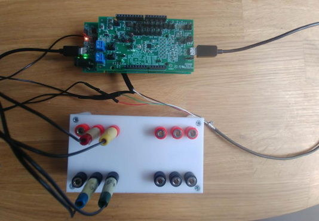
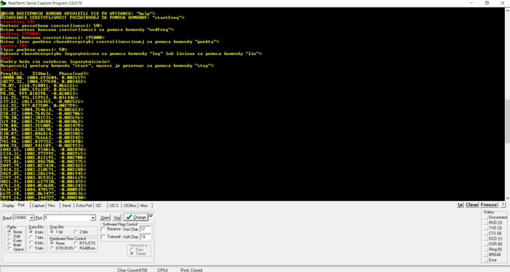
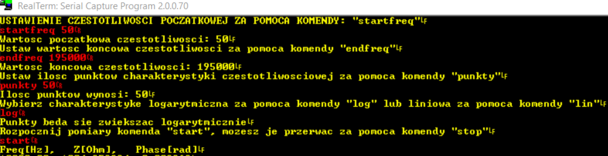
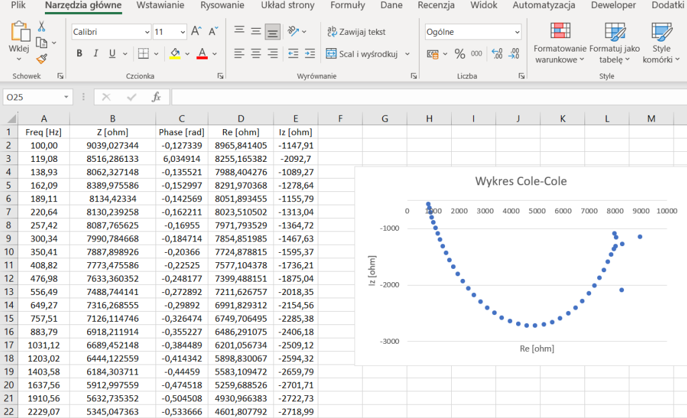
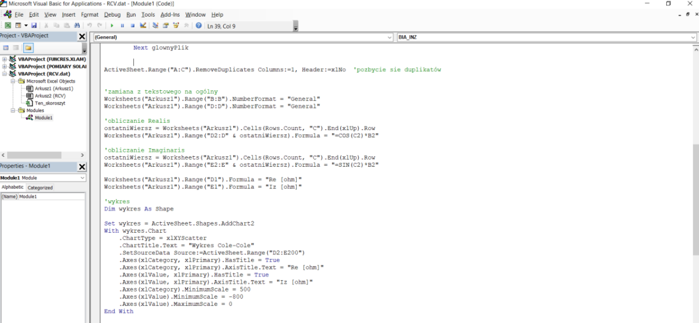

# impedance-spectroscopy
I changed example project from ad5940-examples https://github.com/analogdevicesinc/ad5940-examples (examples/AD5940_BIA).
Developed bioimpedance measurements with microcontroller from Analog Device (EVAL-AD5940BIOZ).  I wrote a program that calculated and displayed the electrical impedance (imaginary and real parts) of a given object and an interface thanks to which the user could change the parameters of the input signal and create the characteristics of a given object (Cole-Cole diagram). The program was written in C in the Keil uVision environment.

# What u need?
Hardware
- EVAL-ADICUP3029
- EVAL-AD5940BIOZ
- Z-Test Board
- Mirco USB to USB cable
- PC or Laptop with a USB port
- Custom Cables (Optional)

Software
- AD5940_BIA Example Project (Git Lab)
- Serial Terminal Program, Such as Putty or RealTerm
- IDE such as IAR or Keil

# Getting Started
Step 1
In ad5940-examples https://github.com/analogdevicesinc/ad5940-examples and on the site https://wiki.analog.com/resources/eval/user-guides/ad5940 u have inscruction how to set up your IDE. 
U need to download my program from repository and add ad6940lib.
The structure of the code should be:
ad5940-examples\doc...
ad5940-examples\examples\ad5940lib\ad5940.c
ad5940-examples\examples\ad5940lib\ad5940.h
ad5940-examples\examples\impedance-spectroscopy\..
ad5940-examples\LICENSE...
ad5940-examples\README.md...

Step 2
Set up hardware based on https://wiki.analog.com/resources/eval/user-guides/eval-ad5940/software_examples/ad5940_bia

Step 3
Download terminal program such as RealTerm or Putty, it's required to display results.
Baud Rate: 230400 and check your port in device manager.
When u open port, program should display question to set up parameters and display impedance results at a given frequency.

Step 4 (optional)
U can save results from Step 3 as "C:\Desktop\BIA\POMIARY.txt" and set up VBA in excel with code 
from "https://github.com/KonradBlonka/BIA_VBA.git". The program will present the results in the form of Cole-Cole charts.

# Hardware

# Interface (terminal)

# Excel (VBA)

